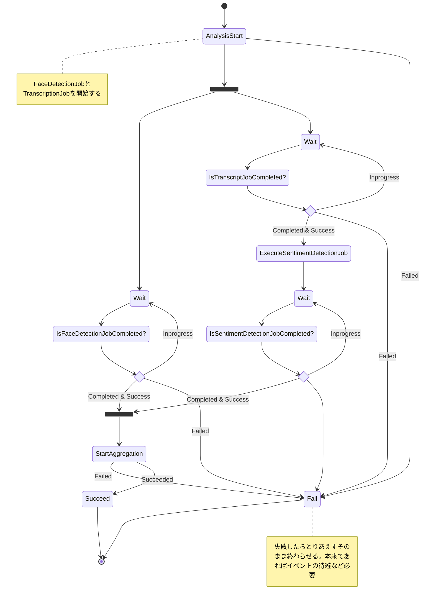

# SentimentAnalysisStack Readme

## やりたいこと

- インタビュー動画から写っている人の`感情` - 喜び、悲しみ、怒り、楽しみを数値化して抽出する

## アーキテクチャ検討

AWS のマネージドサービスを利用して、動画の映像、音声から感情を抽出する。  
利用するマネージドサービスとしては、

- [Amazon Rekognition](https://docs.aws.amazon.com/rekognition/latest/dg/what-is.html): 動画分析サービス。動画内の人の顔を解析し、映像から感情を抽出する
- [Amazon Transcribe](https://docs.aws.amazon.com/transcribe/latest/dg/what-is.html): 音声解析サービス。動画の音声から人が話している内容をテキスト化する
- [Amazon Comprehend](https://docs.aws.amazon.com/comprehend/latest/dg/what-is.html): 自然言語処理(NLP)サービス。Transcribe でテキスト化された内容を感情分析する

Rekognition による映像解析と Transcribe & Comprehend による自然言語処理を並列化し、それぞれのアウトプットを集約した上で感情分析の結果を出力する。

## アーキテクチャ構成図

## SentimentAnalysisWorkflow 状態遷移図

## 今回作成するアーキテクチャの課題

### ストリーミング処理に未対応

現段階では撮影済みの動画を想定しているため、ストリーミングの動画データに対する感情分析については未対応

### StateMachine の状態遷移に関するスロットリング

<!-- TODO: 文章まとめる、一旦リンクのみ -->

https://docs.aws.amazon.com/step-functions/latest/dg/service-quotas.html#service-limits-api-state-throttling

### ラムダ関数：task-contoller-function の責務が大き過ぎる可能性がある

Rekognition, Transcribe, Comprehend に対するジョブの作成・結果取得、並列処理のアウトプットの集約まで一つのラムダ関数で行う。
本来ならば、適度な大きさで分ける必要がある。
